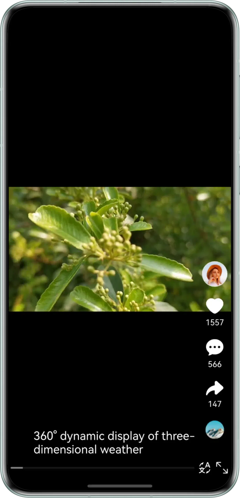

# Short Video Playback Using AVPlayer

## Overview

This sample demonstrates how to develop short video playback applications using AVPlayer, and provides a reusable
solution for enabling smooth video switching.

## Effect



## Features

1. Basic features include playback control, mute control, loop playback, playback speed control, and subtitle loading.
   For details,
   see [Basic Playback Using AVPlayer](https://gitee.com/harmonyos_samples/avplayer-basic-control/blob/master/README.md).
2. Other features include focus management, screen orientation switching and rotation awareness, and
   foreground/background awareness. For details,
   see [Long Video Playback Using AVPlayer](https://gitee.com/harmonyos_samples/avplayer-basic-control/blob/master/README.md).

## How to Use

1. Open the application and swipe up or down to smoothly switch between videos. When you go back to the previous video,
   the video will resume from the last paused position.

## Project Directory

```
├──entry/src/main/ 
├──ets 
│  ├──common 
│  │  ├──contanstants 
│  │  │  └──CommonConstants.ets        // Common constants 
│  │  └──utils 
│  │     ├──Logger.ets                 // Log utility 
│  │     ├──WindowUtil.ets             // Window utility 
│  │     └──TimeUtils.ets              // Time utility 
│  ├──component 
│  │  ├──LanguageDialog.ets            // Language switch dialog component 
│  │  ├──VideoPlayer.ets               // Video playback component 
│  │  ├──SpeedDialog.ets               // Playback speed dialog component 
│  │  └──VideoToolBar.ets              // Video toolbar 
│  ├──controller 
│  │  ├──AvPlayerController.ets        // AVPlayer control class 
│  ├──entryability 
│  │  └──EntryAbility.ets              // Entry function 
│  ├──entrybackupability 
│  │  └──EntryBackupAbility.ets 
│  ├──model 
│  │  ├──AVDataSource.ets              // Data operation class 
│  │  ├──DataModel.ets                 // Data source 
│  │  └──VideoData.ets                 // Data type 
│  └──pages 
│     ├──AVPlayerView.ets              // Video playback page 
│     └──Index.ets                     // Home page 
└──resources                           // Static resources

```

## How to Implement

1. Use the APIs encapsulated in [AvPlayerController.ets](./entry/src/main/ets/controller/AvPlayerController.ets) to
   implement video loading, pausing, playing, and seeking.
2. Use Swiper to implement video switching and LazyForEach for lazy data loading. During carousel, AVPlayer is created
   asynchronously to prepare for the next video.

## Required Permissions

N/A

## Constraints

1. This sample is only supported on Huawei phones running standard systems.

2. The HarmonyOS version must be HarmonyOS 5.1.0 Release or later.

3. The DevEco Studio version must be DevEco Studio 5.1.0 Release or later.

4. The HarmonyOS SDK version must be HarmonyOS 5.1.0 Release SDK or later.


